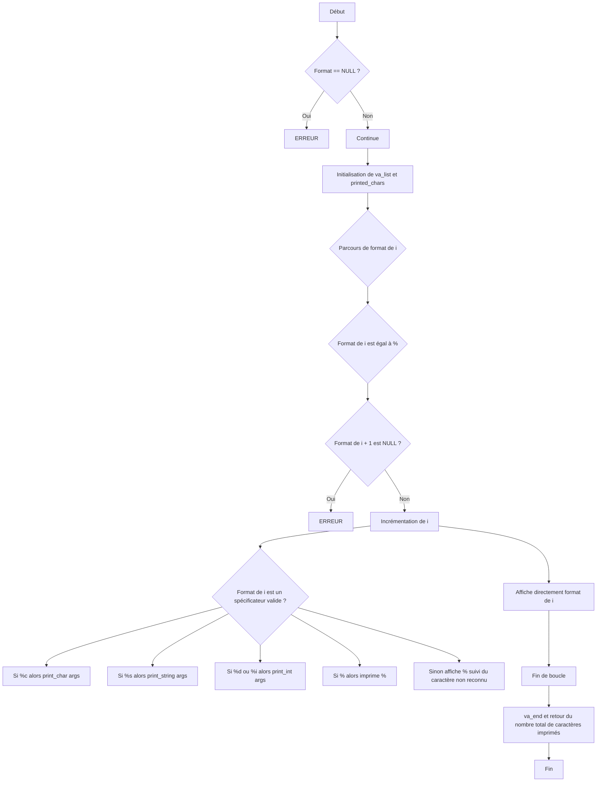

# README PRINTF

La fonction ```_printf``` affiche une sortie. Elle est similaire à la fonction ```printf``` mais avec spécificateurs limités.

## MAIN.C

```c
#include <limits.h>
#include <stdio.h>
#include "main.h"

/**
 * main - Entry point
 *
 * Return: Always 0
 */
int main(void)
{
	int len;
	int len2;
	unsigned int ui;
	void *addr;

	len = _printf("Let's try to printf a simple sentence.\n");
	len2 = printf("Let's try to printf a simple sentence.\n");
	ui = (unsigned int)INT_MAX + 1024;
	addr = (void *)0x7ffe637541f0;
	_printf("Length:[%d, %i]\n", len, len);
	printf("Length:[%d, %i]\n", len2, len2);
    _printf("Negative:[%d]\n", -762534);
    printf("Negative:[%d]\n", -762534);
    _printf("Unsigned:[%u]\n", ui);
    printf("Unsigned:[%u]\n", ui);
    _printf("Unsigned octal:[%o]\n", ui);
    printf("Unsigned octal:[%o]\n", ui);
    _printf("Unsigned hexadecimal:[%x, %X]\n", ui, ui);
    printf("Unsigned hexadecimal:[%x, %X]\n", ui, ui);
    _printf("Character:[%c]\n", 'H');
    printf("Character:[%c]\n", 'H');
    _printf("String:[%s]\n", "I am a string !");
    printf("String:[%s]\n", "I am a string !");
    _printf("Address:[%p]\n", addr);
    printf("Address:[%p]\n", addr);
    len = _printf("Percent:[%%]\n");
    len2 = printf("Percent:[%%]\n");
    _printf("Len:[%d]\n", len);
    printf("Len:[%d]\n", len2);
    _printf("Unknown:[%r]\n");
    printf("Unknown:[%r]\n");
    return (0);
}
```
Commande de compilation et d'éxecution :

```
gcc -Wall -Werror -Wextra -pedantic -std=gnu89 -Wno-format *.c
./a.out
```

Spécificateurs utilisés :
| Spécificateurs            | Description                                                               |
| ----------------- | ------------------------------------------------------------------ |
%c | Affiche un caractère.
%s | Affiche une chaîne de caractères.
%d ou %i | Affiche un entier signé.
%% | Affiche le caractère pourcentage (%).

## FLOWCHART



## EXEMPLES

```c
_printf("Un seul caractère : %c\n", 'A');
/* Sortie : Un seul caractère : A */

_printf("Une chaîne : %s\n", "Hello");
/* Sortie : Une chaîne : Hello */

_printf("Un entier : %d\n", 1234);
/* Sortie : Un entier : 1234 */
```

## MAN PAGE
Voici la man page de la fonction standard printf.
https://man7.org/linux/man-pages/man3/fprintf.3.html

## AUTEURS
Thomas Roncin - https://github.com/IEyZens
Sanoussy Fofana - https://github.com/Samamtro
